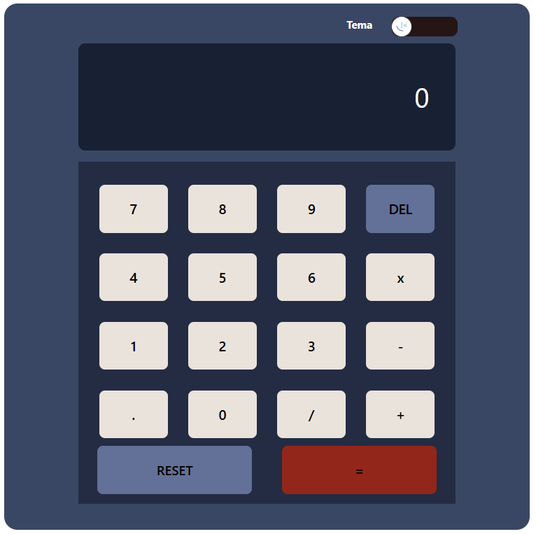

# Calculadora

Sistema de calculadora simples com suporte a três esquemas de cores diferentes.

 

## 🚀 Demonstração

Experimente a calculadora online:

🔗 [calculadora-green-six.vercel.app](https://calculadora-green-six.vercel.app)

## 🧰 Tecnologias Utilizadas

- **HTML5**
- **CSS3**
- **TypeScript**
- **Vite** (para build e desenvolvimento)
- **ESLint** (para linting de código)

## ⚙️ Instalação e Execução Local

Para rodar o projeto localmente, siga os passos abaixo:

1. Clone este repositório:

   ```bash
   git clone https://github.com/DevPeress/Calculadora.git
   cd Calculadora
   ```
2. Instale as dependências:

   ```bash
   npm install
   ```
3. Inicie o servidor de desenvolvimento:

   ```bash
   npm run dev
   ```
4. Abra o navegador e acesse: 

   ```markdown
   [http://localhost:5173](http://localhost:5173)
   ```

## 🎨 Como Alterar o Tema de Cores

A calculadora oferece três esquemas de cores:

- **Verde**
- **Azul**
- **Escuro**

Para alternar entre os temas, clique no ícone de tema localizado no canto superior direito da interface.

## 📄 Licença

Este projeto está licenciado sob a [MIT License](https://opensource.org/licenses/MIT).
